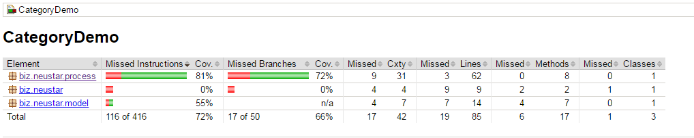

# CategoryDemo

Category and SubCategory System

We need to pass the file name as argument.

### System Requirements:

1. Java version should be greater than 1.7

### External libraries used : 
1. commons-collections
2. Junit

### Algorithm:

1. Read each line from the file
2. And get the category and subcategory
3. Once you get category, sub category add these to Category objcet
4. check for the duplicates if not present add the category objcet category list
5. print the categoryCountMap and categories to console

### How to run:

1. Run from the IDE
2. gradle clean test buildJar  - it will generate the jar file
    
     **java -jar CategoryDemo-1.0.jar 'inputfile'**
    e.g : java -jar CategoryDemo-1.0.jar C:\ValidCategeroyset.txt
   
####File Input:
- PERSON Bob Jones
- PLACE Washington
- PERSON Mary
- COMPUTER Mac
- PERSON Bob Jones
- OTHER Tree
- ANIMAL Dog
- PLACE Texas
- FOOD Steak
- ANIMAL Cat

####Output:
Category	Count  
PERSON	    2  
PLACE	    2  
ANIMAL	    2  
COMPUTER	1  
OTHER	    1   

PERSON Bob Jones  
PLACE Washington  
PERSON Mary  
COMPUTER Mac  
OTHER Tree  
ANIMAL Dog  
PLACE Texas  
ANIMAL Cat  

###Code Coverage:

Run the below command to get the code coverage report

   **gradle clean test jacocoTestReport**
   
   

###PMD:

###FindBugs:

